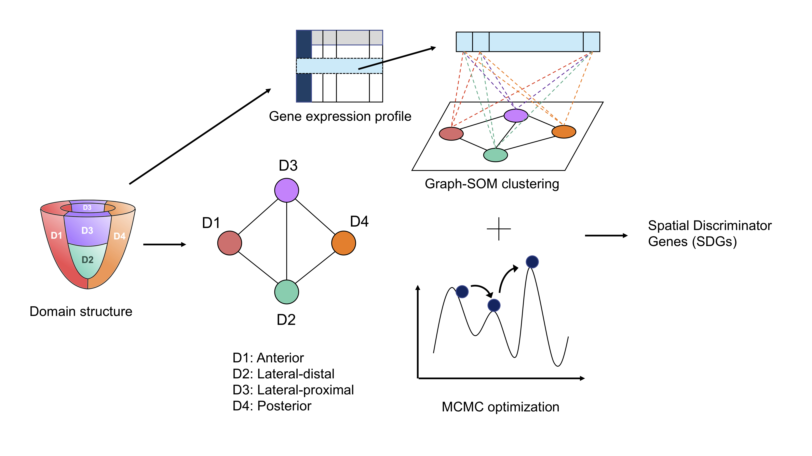

# eSPRESSO

31-Mar-2022: espresso 1.0.1 released.

<br/>

`espresso` is a package for domain estimation of cells only from gene expression profile based on graph-structured stochastic self-organizing map (graph-SOM) and Markov chain Monte Carlo (MCMC) method.



## Installation
Download a code `espresso-X.X.X.tar.gz` or `espresso-X.X.X.zip` from this repository, and
install by the following command.
```
install.packages("espresso-X.X.X.tar.gz", repos = NULL, type = "source")
```

As an alternative way, `espresso` can be installed directly from GitHub.
```
library(devtools)
install_github("tmorikuicr/espresso")
```

## Usage
Refer to the following documentation for the usage of `espresso` package.  
31-Mar-2022: [Vignette](https://tmorikuicr.github.io/espresso/)

## Data and code availability
Preprocessing scripts to generate input data for espresso from raw gene expression data and example scripts of using `espresso` can be downloaded from the following:  
18-Mar-2022: [espresso data](https://sunflower.kuicr.kyoto-u.ac.jp/~tmori/downloads/espresso_data.tar.gz)

## Citing
To cite your use of the espresso software, please reference the following paper:

* Tomoya Mori, Toshiro Takase, Kuan-Chun Lan, Junko Yamane, Cantas Alev, Kenji Osafune, Jun Yamashita, and Wataru Fujibuchi. eSPRESSO: a spatial self-organizing-map clustering method for single-cell transcriptomes of various tissue structure using graph-based networks. bioRxiv. doi: http://doi.org/10.1101/2020.12.31.424948.
