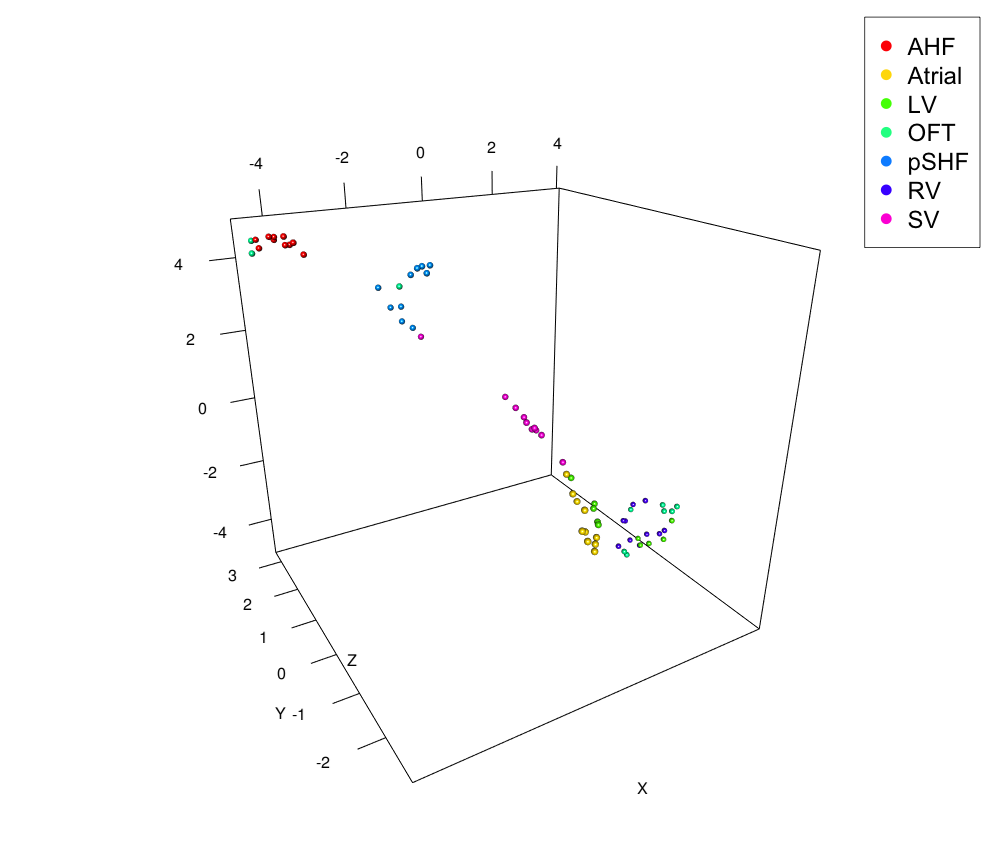

```{r, echo = FALSE}
knitr::opts_chunk$set(
  collapse = TRUE,
  comment = "#>"
)
```

# Introduction

`espresso` is a package for domain estimation of cells only from gene expression profile 
based on graph-structured stochastic self-organizing map (GraphSOM) and Markov chain Monte Carlo (MCMC) method.   
  
    
# Installation

`espresso` can be installed by the following command.

```{r, eval = FALSE}
# Installation (X.X.X is a version number)
install.packages("espresso_X.X.X.tar.gz", repos = NULL, type = "source")
```

If an error message "ERROR: dependencies 'XXX' are not available for package 'espresso'" is displayed
in the installation step, please try to install required packages, which are listed as follows.

__CRAN packages__

* igraph
* mclust
* progress
* umap
* rgl
* rFerns
* Boruta
* doParallel
* foreach
* pheatmap
* RColorBrewer

```{r, eval = FALSE}
# Installation example of CRAN packages
install.packages(c("igraph", "mclust", "progress",
                   "umap", "rgl", "rFerns", "Boruta",
                   "doParallel", "foreach", "pheatmap", "RColorBrewer"), 
                 dependencies = TRUE)
```

__Bioconductor packages__

* biomaRt
* GO.db

```{r, eval = FALSE}
# Installation example of Bioconductor packages
if (!requireNamespace("BiocManager", quietly = TRUE))
    install.packages("BiocManager")

BiocManager::install(c("biomaRt","GO.db"))
```

__Note__

If you try to install or load `espresso` 
on a machine that does not have X11,
a warning message will be displayed because 
`rgl` package requires X11 to be installed.
In such case, install X11, or ignore the warning 
if you do not need UMAP plots.

# Confirmed version
This vignette was generated by the following versions of R and packages.
```{r}
version
packageVersion("igraph")
packageVersion("mclust")
packageVersion("progress")
packageVersion("umap")
packageVersion("rgl")
packageVersion("rFerns")
packageVersion("Boruta")
packageVersion("doParallel")
packageVersion("foreach")
packageVersion("pheatmap")
packageVersion("RColorBrewer")
```

# Quick example

`espresso` can be easily executed by a few funcions. 
Here, the most simple code is shown in the following, assuming that a gene expression profile `exprs`, 
a domain topology `topology`, and a domain assignment `asgmt` are already defined.
The details of these inputs are explained in the later section.

```{r message=FALSE, warning=FALSE, include=FALSE}
library(espresso)
set.seed(0)
```

```{r, eval = FALSE}
library(espresso)

# Initialize espresso object
eobj <- initEsp(exprs, topology, asgmt)

# GraphSOM clustering
eobj <- initGraphSOM(eobj)
eobj <- graphSOM(eobj)

# Show prediction scores
eobj@summary
```

If you need more details of the `espresso` functions,
refere the following sections and help manuals 
by `help` function (e.g., `help(espresso)`, `help(graphSOM)` etc.)

# More details

## Data format
`espresso` requires three inputs, i.e., 
expression profile, domain topology, and domain assignment information 
for cell samples.

* __Expression profile__ `exprs`  
The expression profile is given as a numeric matrix whose rows and columns indicate 
cell samples and genes, respectively.

|        |        |        |        |     |
|:-------|-------:|-------:|-------:|----:|
|        | Gene 1 | Gene 2 | Gene 3 | ... |
| Cell 1 | 0.15   | 0.28   | 1.33   | ... |
| Cell 2 | 1.08   | 0.62   | 0.01   | ... |
| Cell 3 | 0.74   | 0.42   | 0.87   | ... |
| ...    | ...    | ...    | ...    | ... |


* __Domain topology__ `topology`  
The domain topology is given as an adjacent matrix whose rows and columns indicate domains.
In this matrix, `1` and `0` mean that corresponding domains are connected 
(i.e., adjacent each other in living a tissue or an organ) and unconnected, respectively.
Note that this matrix must be symmetric and its diagonals must be filled by `0` since self-loops are not assumed in `espresso`.

|          |          |          |          |          |
|:---------|---------:|---------:|---------:|---------:|
|          | Domain 1 | Domain 2 | Domain 3 | Domain 4 |
| Domain 1 |    0     |    1     |    1     |    0     |
| Domain 2 |    1     |    0     |    1     |    1     |
| Domain 3 |    1     |    1     |    0     |    1     |  
| Domain 4 |    0     |    1     |    1     |    0     |

* __Domain assignment__ `asgmt`  
The Domain assignment is given as a `data.frame` with two columns which indicate
cell samples and corresponding domains.

|         |          |
|:--------|:--------:|
| sample  | domain   |
| Cell 1  | Domain 1 |
| Cell 2  | Domain 2 |
| Cell 3  | Domain 1 |
| Cell 4  | Domain 4 |
| ...     | ...      |

`espresso` contains example inputs of raw datasets for the above three inputs:
"exprs_soysa19_e825.txt", "topology_soysa19_e825.txt", and "asgmt_soysa19_e825.txt",
which can be loaded by the following commands.
The expression profile "exprs_soysa19_e825.txt" was created from 
[GSE126128_E775E825_WTKO_10X.csv.gz](https://www.ncbi.nlm.nih.gov/geo/query/acc.cgi?acc=GSE126128) 
by random selection of 10 single-cells from each domain i.e., 70 cell-samples in total.

```{r}
# Get paths of input files
path_exprs <- system.file("extdata", "exprs_soysa19_e825.txt", package="espresso")
path_topology <- system.file("extdata", "topology_soysa19_e825.txt", package="espresso")
path_asgmt <- system.file("extdata", "asgmt_soysa19_e825.txt", package="espresso")

# Load data
exprs <- t(read.table(path_exprs, header = TRUE, row.names = 1, sep = "\t", 
                      as.is = TRUE, check.names = FALSE))
topology <- as.matrix(read.table(path_topology, header = T, row.names = 1))
asgmt <- read.table(path_asgmt, header = T, as.is = TRUE)

# Show the contents of the objects
exprs[1:5, 1:5]
topology
head(asgmt)
```


## Initialization of ESPRESSO object 

Before executing GraphSOM clustering, `espresso` object should be prepared.
The variables `exprs`, `topology`, and `asgmt` are inputs explained above.
`initEsp` is a function to initialize and return an `espresso` object.

```{r}
eobj <- initEsp(exprs, topology, asgmt)
```

The `espresso` object is defined as `S4` class, and its slots can be accessed by `@` symbol.

```{r}
str(eobj)
```

## Preprocessing (Optional)

`espresso` provides simple preprocessing functions for log-scalling of expression profile and 
filtering out of low expressed and low variable genes. 
If the input expression profile need not be preprocessed, this procedure can be ignored.

### Log-scalling

The input gene expression data can be scaled by log10 as preprocessing.
The base can be changed by specifying `base = "2"` or `base = "e"`.

```{r, eval = FALSE}
# Log-scaling of the expression profile
# In this example, log-scalling is unnecessary since the expression values is already log-scalled.
# eobj <- logScale(eobj)
```

### Gene filtering
The low expressed and low variable genes can be filtered out by the following command.
As default setting, genes with expression level of higher than 1 in at least two cells 
and whose standard deviation of expression levels through all cells more than 0.05 can pass the filitering.

```{r}
# Filter out genes with low expresssion and low variance
eobj <- filterGenes(eobj)
```

The parameters can be changed by specifying the arguments cell, expressed, and sd, i.e., the default setting is `ncell = 2`, `expressed = 1.0`, and `sd = 0.05`.

```{r, eval = FALSE}
# Filter out genes with low expresssion and low variance
eobj <- filterGenes(eobj, ncell = 2, expressed = 1.0, sd = 0.05)
```

## GraphSOM clustering

Before starting GraphSOM clustering, the parameters for GraphSOM clustering should be initialized.

```{r, eval = FALSE}
eobj <- initGraphSOM(eobj)
```

In this case, all cell samples and genes are used for the clustering, 
so that it will take a long time to 
execute when the input gene expression profile is quite large.

Therefore, if downsampling is required, `graphSOM` can be executed with subsets of cell samples 
selected uniformly random from each domain, and repeats the clustering with different sets.
The `nsamples` indicates the number of samples extracted from each domain, i.e., 
`nsamples = 10` under a dataset with 4 domains means that 40 cell samples will be selected.
If the total number of samples of a certain domain is less than the value specified `nsamples`, 
all samples of the domain are selected. 
The `rep` is the number of replication for GraphSOM clustering with different sample sets.

In addition, other parameters are also provided.
The `nmax` specifies the maximum number of genes to be analyzed.
This is provided to prevent the calculation from not completing due to the large size of gene set being given.
The `coef` is the coefficient of ARI value for score function. 
The GraphSOM results are evaluated by prediction accuracy, ARI, and a score function (= accuracy + `coef` * ARI).

```{r}
eobj <- initGraphSOM(eobj, nsamples = 10, nmax = 200, coef = 0.5, rep = 3)
```

After initializing GraphSOM setting, GraphSOM can be executed.
The most simple way to execute GraphSOM clustering undere the parameter setting given by `initGraphSOM` is as follow.

```{r, eval = FALSE}
eobj <- graphSOM(eobj)
```

As another option,
`graphSOM` can be executed with a specific gene set by setting it
to the parameter `gset` as a `vector`.

```{r}
eobj <- graphSOM(eobj, gset = c("Actn2", "Hand2", "Vegfb", "Wnt5a"))
```

In addition to these, `graphSOM` has several parameters, so please refer to 
the manual for their details.  
  
The `graphSOM` clustering results can be shown by the following.

```{r}
eobj@summary
```

The results are mean values and mean variance of the score, the prediction accuracy, and ARI for 
the replications specified in `graphSOM` function.
The resuls of each replication can also be shown.

```{r}
eobj@score
```

The convergence curve can be shown.
`rep` indicates the replication number to be plotted.

```{r}
plotConvCurve(eobj, rep = 1:2)
```

The multiple results are plotted at the same time by the following example code.

```{r, eval = FALSE}
par(mfrow = c(2,2))
plotConvCurve(eobj)
dev.off()
```


## Feature gene selection based on random forest

`espresspo` provides a function for feature gene selection `selectFeatures`.
This function is a rapper function of `Boruta` function of `Boruta` package, which is a 
feature gene selection method based on random forest.
The usage of this function is very simple.

```{r}
fgenes <- selectFeatures(eobj, maxRuns = 100)

fgenes
```

The parameter `maxRuns` is the maximum number of importance source runs (refer the manual of `Boruta` pacakage).
This function returns a vector of "confirmed" genes as features.
In order to resolve genes left as "tentative", `maxRuns` may be increased.
Empirically, it is good to determine the parameters so that around 100 genes are selected.


## Usage of Gene Ontology (GO) information (optional)

In order to execute `graphSOM` with functional gene sets already defined,
`espresso` provides us with gene sets in GO database.

```{r}
# Mouse gene sets (Ensembl release version 101)
data(mm_symbol_v101)

# Human gene sets (Ensembl release version 101)
data(hs_symbol_v101)
```

If aother version, another species, or another gene idenfier are required,
the following command enable a user to create another gene set via R `biomaRt` package.
The parameters to be set to `species` are `gid` according to `biomaRt`.
Note that if the latest version is required, please do not specify `version` in the function.

```{r, eval = FALSE}
# Get GO infomation
hs_symbol_v98 <- getGO(species = 'hsapiens', gid = 'hgnc_symbol', version = '98')

# Save 'hs_symbol_v98' as an R data file.
save(hs_symbol_v98, file = "hs_symbol_v98")

# Load 'hs_symbol_v98'
load(hs_symbol_v98)
```

The GO information are stored as a list, and each element of list has two vectors, `term` and `genes`.
```{r}
mm_symbol_v101[["GO:0003209"]][["term"]]

mm_symbol_v101[["GO:0003209"]][["genes"]]
```

Thus, `graphSOM` execution using GO genes can be done by

```{r, eval = FALSE}
eobj <- graphSOM(eobj, gset = mm_symbol_v101[["GO:0003209"]][["genes"]], 
                 nsamples = 10, rep = 3)
```

If you want to avoid execution on genes that are too small or too large, 
you can specify a range of gene sizes that can be executed by the parameters `nmin` and `nmax`.
In the case that the number of genes exceeds the limits, 
`NA`s are assigned to `eobj@summary`.

```{r, eval = FALSE}
eobj <- graphSOM(eobj, gset = mm_symbol_v101[["GO:0003209"]][["genes"]], 
                 nsamples = 10, rep = 3, nmin = 1, nmax = 100)
```


## Gene set optimization by replica exchange Marcov chain Monte Carlo method (RX-MCMC).

`espresso` optimizes gene sets by replica exchange Markov chain Monte Carlo method (RX-MCMC).
The parameters `itr`, `n_ex`, and `n_rep` are the number of iterations of MCMC until each replica exchange, 
the number of times of exchanges, and the number of replicas, respectively.
Thus, the total number of MCMC steps is `itr * n_ex`.
If the user's machine has multi-core processors, the MCMC computations of each replica are parallelized.

```{r, message = FALSE}
eobj <- initGraphSOM(eobj, nsamples = 10, rep = 1, coef = 0.5)
eobj <- rxmcmc(eobj, gset = fgenes, itr = 2, n_ex = 5, n_rep = 4)
```

Although the number of cores is automatically detected, it can be specified by `n_cl`.
In addition, as the default setting, MCMC optimizations are started with 3 genes randomly selected from 
the gene set specified by `gset`. However it can be also modified by `n_ig`.

```{r, eval = FALSE}
eobj <- rxmcmc(eobj, gset = fgenes, itr = 2, n_ex = 5, n_rep = 4, n_cl = 4, n_ig = 3)
```

The results of RX-MCMC are stored in `espresso` objects and they can be accessed by `@mcmc`.

* `eobj@mcmc[["sampling"]]`: History of sampling
* `eobj@mcmc[["best"]]`: History of the best samples
* `eobj@mcmc[["exchange"]]`: History of replica exchange
* `eobj@mcmc[["best_genes"]]`: The best genes

```{r}
eobj@mcmc[["sampling"]][["rep.1"]]
eobj@mcmc[["best"]][["rep.1"]]
eobj@mcmc[["exchange"]]
eobj@mcmc[["best_genes"]]
```


The histories of RX-MCMC optimization and replica exchanges can be plotted by 
`plotMCMC` function.

```{r, fig.width = 8, fig.height = 8, out.width = "45%"}
plotMCMC(eobj)
```


## Plot distance maps

In order to visualize the distance between domains and between cell samples before/after clustering for all replications,
`espresso` provides `plotDistMap`. The usage is quite simple.
```{r, fig.width = 8, fig.height = 8, out.width = "45%"}
plotDistMap(eobj)
```


## Plot UMAP
`espresso` provides a function for dimension reduction method named 
Uniform Manifold Approximation and Projection (UMAP) to show the distribution of the cell samples 
in 3D space. If `gset = NULL`, UMAP is performed with genes stored in `@gset`.

```{r, eval = FALSE}
plotUMAP(eobj)
```

This function imports `umap` packages, thus several parameters for UMAP computation can be
given according to the original package.

```{r}
plotUMAP(eobj, gset = eobj@mcmc[["best_genes"]],
         n_neighbors = 5, n_components = 3, n_epochs = 1000)
```

```{r, echo=FALSE, fig.cap= "UMAP", out.width = '50%'}

```

If `movie = TRUE`, a movie of the resulting UMAP is generated.
In addition, plotting colors can be changed by any colors.
Please refer the manual for more details.


```{r, eval = FALSE}
domain_colors <- list(AHF = "orange",
                      Atrial = "pink",
                      LV = "green",
                      OFT = "lightblue",
                      pSHF = "purple",
                      RV = "blue",
                      SV = "plum"
                      )
plotUMAP(eobj, gset = eobj@mcmc[["best_genes"]],
         n_neighbors = 5, n_components = 3, n_epochs = 1000,
         movie = TRUE, domcol = domain_colors)

```

UMAP is even more effective for overviewing distribution of cell samples when the number of cell samples is large.
The following figure is UMAP using GO\:0003209 for 3,331 cell samples obtained from 
[GSE126128_E775E825_WTKO_10X.csv.gz](https://www.ncbi.nlm.nih.gov/geo/query/acc.cgi?acc=GSE126128).

```{r, echo=FALSE, fig.cap= "UMAP", out.width = '50%'}
knitr::include_graphics("umap.all.png")
```


